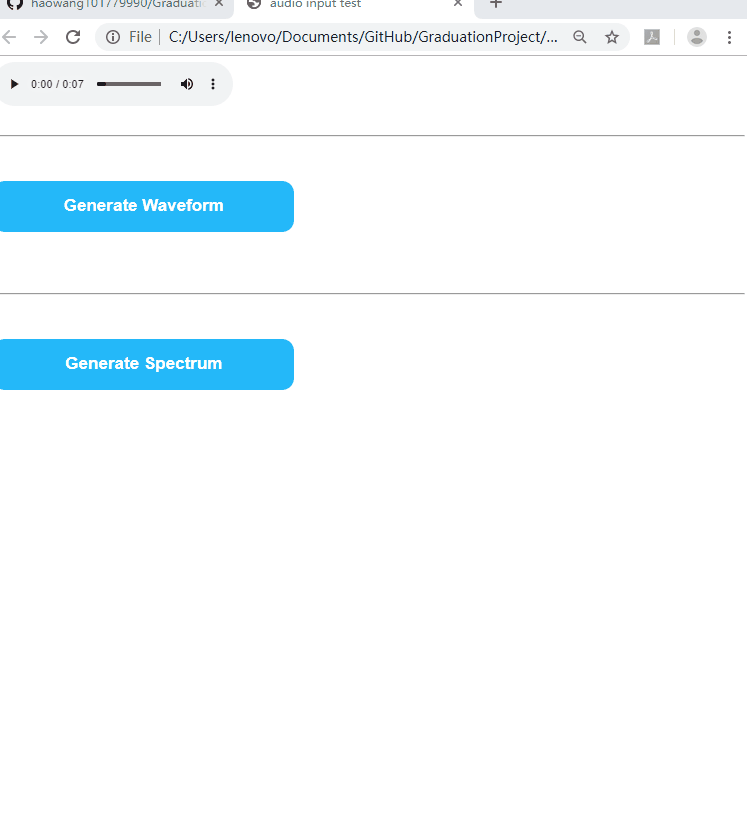

# Drawing Audio Spectrum and Formants extraction by LPC on webs

## Get a glimpse of this project

This project aims at drawing the following features for an input 
audio wav file:

 - A sacalable time-domain waveform  
 - Custom frequency-domain spectra frame by frame 
 - Visualize the envelope and extract formants on the spectra 
   through Levinson-Durbin LPC computation.

## Get your hands dirty with it! 

1. clone the project 

```
  git clone https://github.com/haowang101779990/GraduationProject.git
```

2. In the cloned directory, open index.html in Chrome/Firefox of recent versions.

2. I put some wav. file already in ./sound_files , drag on of them into the
   into the input block

<p align="center">
 <br />
Drag your input audio file
</p>

3. draw time-domain waveform :

<p align="center">
 <br />
Drag your input audio file
</p>

4. draw frequency-domain features: spectrum. envelope. formants.

<p align="center">
 <br />
Drag your input audio file
</p>
